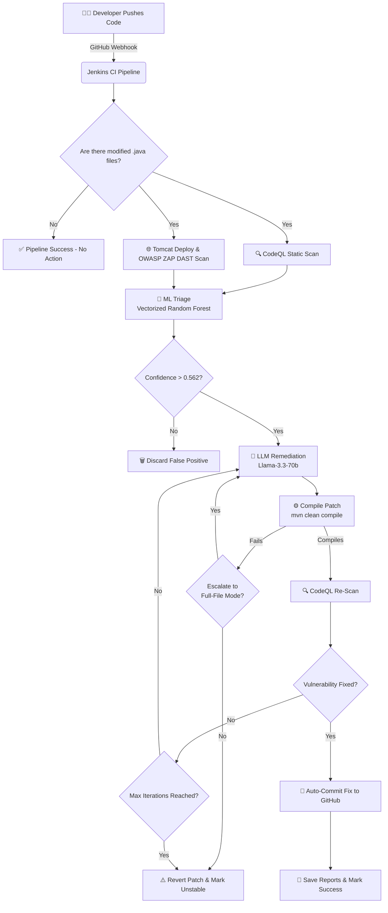

# 🛡️ Agentic AI for Intelligent Vulnerability Triage & Patch Suggestion
### Hybrid SAST + DAST + Machine Learning + Self-Healing CI/CD Pipeline

---

## 📌 Project Overview

This project implements a fully autonomous **agentic vulnerability detection, triage, and self-healing system** for Java codebases. 

It completely automates the security lifecycle by integrating:
- ✅ **CodeQL** for deep Static Application Security Testing (SAST).
- ✅ **OWASP ZAP** for Dynamic Application Security Testing (DAST) on deployed applications.
- ✅ **Machine Learning (Random Forest)** to filter out false positives and score alert confidence using context-aware, 13-dimensional vectorized feature engineering.
- ✅ **LLM-Based Remediation (Llama-3.3-70b)** for generating precise, context-aware code patches.
- ✅ **Validation Loop** that ensures patches compile, deploy, and actually fix the vulnerability.
- ✅ **Jenkins CI/CD Automation** to trigger in real-time, execute the agentic loop, run health checks, and automatically commit fixes back to the repository.

---

## 🚀 The Agentic CI/CD Pipeline Workflow

The pipeline operates as a **self-healing security agent** triggered automatically on every code push. Here is the step-by-step lifecycle of a commit:

### 1. Webhook Trigger
The developer commits and pushes code to GitHub (`git push origin main`). A GitHub Webhook instantly notifies the local Jenkins server (exposed via ngrok), triggering the pipeline.

### 2. Change Detection & Setup
Jenkins checks out the code, detects which `.java` files were modified in the commit, and initializes the Python environment with required ML and LLM dependencies.

### 3. Comprehensive Scanning (SAST + DAST)
- **SAST (CodeQL):** The agent builds a CodeQL database of the project using Maven (`mvn clean compile`) and runs specialized Java security queries to generate a comprehensive SARIF report.
- **DAST (OWASP ZAP):** The application is deployed locally to a Tomcat server. A health-check script ensures the server is ready, followed by an automated OWASP ZAP baseline scan that generates a detailed DAST report.

### 4. ML Triage (Vectorized Feature Engineering & False-Positive Filtering)
The pipeline extracts advanced features from the SARIF alerts and source code:
- **13-Dimensional Vulnerability Vector:** File context is represented as a distribution of vulnerability types.
- **Weighted Signal Boosting:** Features like `same_type_count` and `weighted_alert_count` (with `SELF_WEIGHT = 3.0`) are used to strongly distinguish true positives.
- **Random Forest Classifier:** The engineered dataset is passed through a highly optimized Random Forest model. Alerts with a confidence score above the empirically determined optimal threshold (≥ 0.562) proceed to the patching phase.

### 5. LLM Remediation & Agentic Validation Loop
For each confirmed vulnerability, the agent enters a self-healing loop (up to 3 iterations):
- **Iter 1 & 2 (Snippet Mode):** The agent sends a ±5-line context window around the vulnerable line to the Groq LLM (Llama-3.3-70b). The LLM returns a precise patch. 
- **Compilation Check:** The agent writes the patch and immediately tests it via `mvn clean compile`. If it fails, the patch is auto-reverted and the agent escalates.
- **Iter 3 (Full-File Escalation):** If snippet patching fails, the agent sends the entire file to the LLM to resolve complex, multi-line structural issues.
- **Re-Scan Verification:** After a successful compile, the codebase is re-scanned to ensure the vulnerability is genuinely fixed without introducing new flaws.

### 6. Auto-Commit and Reporting
If the agentic loop successfully resolves the vulnerabilities, Jenkins uses a Personal Access Token (PAT) to commit and push the patched code back to the GitHub repository. Finally, it archives the run's SARIF, DAST, and JSON reports into a local `reports/` directory.

---

## 📊 Pipeline Visualization



---

## 📁 Repository Structure

```text
BenchmarkJava/
│
├── agent_pipeline.py                 # Main security agent & remediation loop
├── build_ml_dataset_weighted.py      # Feature engineering (13-dim vector, weights)
├── train_rf_weighted.py              # ML training script for vectorized dataset
├── rf_model_weighted.pkl             # Trained optimized classifier
├── ml_dataset_weighted.csv           # Final ML dataset with engineered features
├── zap_scan.py                       # DAST Automation script for OWASP ZAP
├── zap_full_report.py                # ZAP DAST report parser
│
├── Jenkinsfile                       # Jenkins Declarative Pipeline
├── jenkins-setup.sh                  # Local Jenkins setup automation
├── reports/                          # Auto-generated vulnerability reports
├── thesis_template/                  # Final thesis documentation in LaTeX
├── .gitignore
└── README.md
```

---

## ⚙️ Setup & Architecture Instructions

### 1. Jenkins & GitHub Webhook Setup
1. Run `./jenkins-setup.sh` to download and start a local Jenkins instance on port 8080.
2. Use **ngrok** to expose Jenkins to the internet: `ngrok http 8080`.
3. In GitHub, go to Repository Settings → Webhooks, and add `<ngrok-url>/github-webhook/` (Content-Type: `application/json`, Trigger on `Push`).
4. In Jenkins, create a "Pipeline script from SCM" job pointing to your Git repository. Ensure the **"GitHub hook trigger for GITScm polling"** is checked.
5. Add your GitHub Personal Access Token (PAT) with `Contents: Read and write` access to Jenkins credentials as `github-creds`.

### 2. API Keys & Environment Variables
Configure the following in Jenkins (Manage Jenkins → Environment Variables):
- `GROQ_API_KEY`: Your API key for Llama-3.3-70b.

### 3. Dependencies
Ensure CodeQL, OWASP ZAP, Tomcat, and Maven are installed and available. The Python virtual environment is handled automatically by the Jenkinsfile during the pipeline execution.

---

## 📈 Performance Metrics

By leveraging context-aware vectorized features (13-dim representations) and weighted signal boosting, the system drastically reduces the false positive rate common to standard static analysis.

| Model                 | False Positive Reduction | Precision-Recall AUC | ROC AUC | Threshold |
| --------------------- | ------------------------ | -------------------- | ------- | --------- |
| Static Only           | Baseline                 | Baseline             | ~0.5    | N/A       |
| Basic Alert Count     | Moderate                 | Improved             | Good    | 0.50      |
| **Vectorized & Weighted** | **Maximum**          | **Superior**         | **High**| **0.562** |

*(Detailed metrics and precision-recall graphs are generated in the `BenchmarkJava/visualizations` directory.)*

---

## 👨‍💻 Authors
- **Arpit Anand** - IIT2023170
- **Snehal Gupta** - IIT2023169
- **Ansh Namdeo** - IIT2023141
