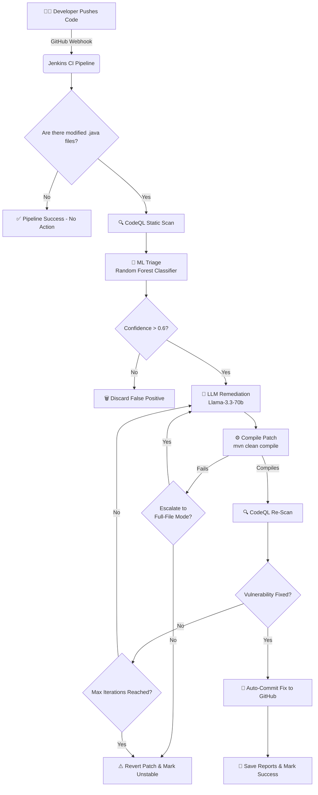

# 🛡️ Agentic AI for Intelligent Vulnerability Triage & Patch Suggestion
### Hybrid Static Analysis + Machine Learning + Self-Healing CI/CD Pipeline

---

## 📌 Project Overview

This project implements a fully autonomous **agentic vulnerability detection, triage, and self-healing system** for Java codebases. 

It completely automates the security lifecycle by integrating:
- ✅ **CodeQL** for deep static analysis (SAST).
- ✅ **Machine Learning (Random Forest)** to filter out false positives and score alert confidence.
- ✅ **LLM-Based Remediation (Llama-3.3-70b)** for generating code patches.
- ✅ **Validation Loop** that ensures patches compile and actually fix the vulnerability.
- ✅ **Jenkins CI/CD Automation** to trigger in real-time, execute the agentic loop, and automatically commit fixes back to the repository.

---

## 🚀 The Agentic CI/CD Pipeline Workflow

The pipeline operates as a **self-healing security agent** triggered automatically on every code push. Here is the step-by-step lifecycle of a commit:

### 1. Webhook Trigger
The developer commits and pushes code to GitHub (`git push origin main`). A GitHub Webhook instantly notifies the local Jenkins server (exposed via ngrok), triggering the pipeline.

### 2. Change Detection & Setup
Jenkins checks out the code, detects which `.java` files were modified in the commit, and initializes the Python environment with required ML and LLM dependencies.

### 3. Static Analysis (CodeQL)
The agent builds a CodeQL database of the project using Maven (`mvn clean compile`) and runs 80 specialized Java security queries to generate a comprehensive SARIF report of potential vulnerabilities.

### 4. ML Triage (False-Positive Filtering)
The pipeline extracts contextual features (e.g., presence of dangerous APIs, user input indicators) and runs them through a trained **Random Forest Classifier**. Only vulnerabilities with a high confidence score (≥ 0.6) proceed to the patching phase, effectively eliminating alert fatigue.

### 5. LLM Remediation & Agentic Validation Loop
For each confirmed vulnerability, the agent enters a self-healing loop (up to 3 iterations):
- **Iter 1 & 2 (Snippet Mode):** The agent sends a ±5-line context window around the vulnerable line to the Groq LLM (Llama-3.3-70b). The LLM returns a precise patch. 
- **Compilation Check:** The agent writes the patch and immediately tests it via `mvn clean compile`. If it fails, the patch is auto-reverted and the agent escalates.
- **Iter 3 (Full-File Escalation):** If snippet patching fails, the agent sends the entire file to the LLM to resolve complex, multi-line structural issues.
- **Re-Scan Verification:** After a successful compile, CodeQL re-scans the codebase to ensure the vulnerability is genuinely fixed.

### 6. Auto-Commit and Reporting
If the agentic loop successfully resolves the vulnerabilities, Jenkins uses a Personal Access Token (PAT) to commit and push the patched code back to the GitHub repository. Finally, it archives the run's SARIF and JSON reports into a local `reports/` directory.

---

## 📊 Pipeline Visualization



---

## 📁 Repository Structure

```text
BenchmarkJava/
│
├── agent_pipeline.py              # Main security agent & remediation loop
├── build_ml_dataset.py            # Dataset generation with context features
├── train_random_forest.py         # ML training script
├── rf_model.pkl                   # Trained classifier
├── ml_dataset_enhanced.csv        # Final ML dataset
├── labeled_static_dataset.csv     # Ground truth benchmark data
│
├── Jenkinsfile                    # Jenkins Declarative Pipeline
├── jenkins-setup.sh               # Local Jenkins setup automation
├── reports/                       # Auto-generated vulnerability reports
├── .gitignore
└── README.md
```

---

## ⚙️ Setup & Architecture Instructions

### 1. Jenkins & GitHub Webhook Setup
1. Run `./jenkins-setup.sh` to download and start a local Jenkins instance on port 8080.
2. Use **ngrok** to expose Jenkins to the internet: `ngrok http 8080`.
3. In GitHub, go to Repository Settings → Webhooks, and add `<ngrok-url>/github-webhook/` (Content-Type: `application/json`, Trigger on `Push`).
4. In Jenkins, create a "Pipeline script from SCM" job pointing to your Git repository. Ensure the **"GitHub hook trigger for GITScm polling"** is checked.
5. Add your GitHub Personal Access Token (PAT) with `Contents: Read and write` access to Jenkins credentials as `github-creds`.

### 2. API Keys & Environment Variables
Configure the following in Jenkins (Manage Jenkins → Environment Variables):
- `GROQ_API_KEY`: Your API key for Llama-3.3-70b.

### 3. Dependencies
Ensure CodeQL is installed and available in the PATH. The Python virtual environment is handled automatically by the Jenkinsfile during the pipeline execution.

---

## 📈 Performance Metrics

By leveraging the contextual code features and ML filtering, the system drastically reduces the false positive rate common to standard static analysis.

| Model       | Accuracy | Precision | Recall   | F1       |
| ----------- | -------- | --------- | -------- | -------- |
| Static Only | 0.654    | 0.60      | 0.903    | 0.74     |
| Basic RF    | 0.79     | 0.83      | 0.86     | 0.84     |
| **Enhanced RF** | **0.82** | **0.86**  | **0.88** | **0.87** |

---

## 👨‍💻 Authors
- **Arpit Anand** - IIT2023170
- **Snehal Gupta** - IIT2023169
- **Ansh Namdeo** - IIT2023141
